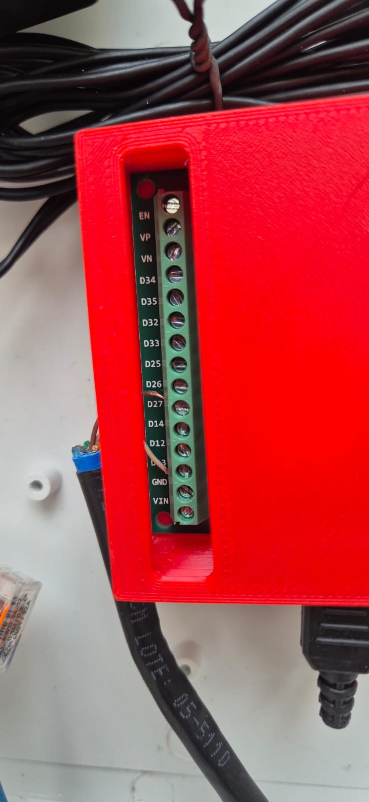

# Automação Leitura Medidor de Gás COMGÁS Daesung G1.6

> Leia o consumo de gás natural do seu medidor COMGÁS em tempo real no Home Assistant, usando um ESP32 + ESPHome e um **reed switch** — **sem solda, sem abrir o medidor e sem violar o lacre**.


O medidor **Daesung G1.6** (diafragma, padrão COMGÁS; distribuído no Brasil como **DAEFLEX**) tem, no último rolo do contador, um **ímã de fábrica** previsto para leitura remota. Este projeto encosta um **reed switch DAEFLEX** nesse ponto, conta os pulsos num ESP32 rodando ESPHome e joga vazão e consumo acumulado direto no Home Assistant.


---

## Por que esse projeto existe

A conta da COMGÁS chega uma vez por mês com um número só: quantos metros cúbicos de gás você gastou. Entre uma leitura e outra, o consumo é uma caixa-preta. Você não sabe quanto puxa o aquecedor, o fogão ou a churrasqueira — nem, o mais importante, **se há um vazamento silencioso**.

A ideia aqui é a mesma que já se faz com energia e água: enxergar o consumo em tempo real. Como o medidor da COMGÁS já tem o ímã de leitura remota previsto de fábrica, dá para usar um reed switch externo em vez de qualquer adaptação invasiva. O resultado é um sensor barato, preciso e que conversa nativamente com o Home Assistant — irmão do projeto do [hidrômetro Sabesp](https://github.com/grfernandes54).

---

## O que você vai conseguir

- 🔥 **Vazão de gás em tempo real** (m³/h), atualizada a cada 30 s
- 📈 **Volume acumulado** diário e mensal, persistente entre reboots
- ⚡ **Integração com o Energy dashboard** do Home Assistant (categoria Gás), com gráficos automáticos
- 🚨 **Base para detecção de uso anormal** — automação que avisa se há fluxo quando ninguém deveria estar usando gás (possível vazamento)
- 💰 **Estimativa de custo** COMGÁS a partir do consumo medido
- 🔌 **Sensor sem solda** — conexões por borne parafusável, WAGO e emenda IP68

---

## Compatibilidade

> ⚠️ **Leia antes de comprar.** O reed switch DAEFLEX só funciona em medidores que tenham o **ímã interno** no rolo do contador. O fator é **10 L/pulso** (especificação do fabricante), mas **valide o seu** — veja [docs/CALIBRACAO.md](docs/CALIBRACAO.md).

- ✅ **CONFIRMADO:** Daesung G1.6 (DAEFLEX) fornecido pela COMGÁS, com reed switch DAEFLEX oficial.
- 🟡 **PROVAVELMENTE COMPATÍVEL:** outros medidores Daesung/DAEFLEX (G0.6, G1.0, G1.6, G2.5, G4...) com o reed oficial. A ligação é a mesma; confirme o ímã.
- ❌ **INCOMPATÍVEL:** medidores de outras marcas (o reed DAEFLEX é específico) e medidores sem o ímã de leitura remota.

> 💡 **O que é um reed switch?** É um contato seco que **fecha quando um ímã passa perto**. Não tem eletrônica nem alimentação: são só dois fios que se tocam (curto) na presença do ímã e abrem quando ele se afasta. A cada volta do último rolo do contador (= 10 L de gás), o ímã passa pelo reed e gera **um pulso**.

---

## Lista de materiais

| Item | Especificação | Onde comprar | Custo aprox. (BRL) |
|------|---------------|--------------|--------------------|
| **Sensor Reed Switch DAEFLEX** | contato seco, 10 L/pulso, cabo 75 cm | [Elite Gás](https://www.elitegas.com.br/produtos/sensor-reed-switch-daeflex/) | R$ 130–140 |
| ESP32 | DOIT DevKit, WROOM-32, 30 pinos | [Mercado Livre](https://www.mercadolivre.com.br/esp32-doit-devkit-com-esp32-wroom-32/p/MLB28251016) | R$ 35–50 |
| **Placa adaptador + case 3D** | terminal borne p/ ESP32 30 pinos | [Mercado Livre](https://produto.mercadolivre.com.br/MLB-4163899841) | R$ 40–60 |
| Caixa hermética IP65 | branca, média (Multitoc) | [Mercado Livre](https://www.mercadolivre.com.br/caixa-hermetica-media-ip65-plastico-branco-multitoc-redes-e-cftv/p/MLB28516621) | R$ 60–90 |
| Prensa-cabo PG16 IP68 | nylon (kit 10) | [Mercado Livre](https://www.mercadolivre.com.br/kit-10-pecas-prensa-cabo-nylon-pg16-ip68/p/MLB2082865013) | R$ 20–30 |
| Emenda IP68 alavanca | conector 2 vias 32A impermeável | [Mercado Livre](https://www.mercadolivre.com.br/conector-emenda-fio-alavanca-2-vias-32a-ip68-impermeavel/up/MLBU1452873958) | R$ 25–35 |
| Conectores WAGO 221-415 | 5 vias (4 un) | [Mercado Livre](https://www.mercadolivre.com.br/4un-conector-wago-221415-5-vias-32a450v-emenda-original/up/MLBU1426731926) | R$ 25–35 |
| Tomada externa 10A | Tramontina Lizflex | [Mercado Livre](https://www.mercadolivre.com.br/tomada-simples-externa-10a-lizflex-tramontina-cor-branco/p/MLB22291879) | R$ 15–25 |
| Fonte micro-USB | 5 V / 3 A (V8) | [Mercado Livre](https://www.mercadolivre.com.br/fonte-de-alimentacao-5v-3a-plug-micro-usb-v8/up/MLBU3238873285) | R$ 20–30 |
| Cabo de rede CAT6 FTP | blindado, externo dupla capa (10 m) | [Mercado Livre](https://www.mercadolivre.com.br/cabo-rede-cat6-blindado-ftp-externo-dupla-capa-preto-10m/up/MLBU3798906789) | R$ 40–60 |
| Kit brocas escalonadas | 4-12 / 4-20 / 4-32 mm | [Mercado Livre](https://www.mercadolivre.com.br/kit-brocas-escalonada-4-12mm-4-20mm-4-32mm-3-perfurantes/p/MLB2039402524) | R$ 30–50 |

**Total: ~R$ 440–580.** Ferramentas extras: furadeira, chave de fenda, alicate decapador, multímetro.

> 💡 **Por que a placa adaptador com bornes?** Elimina o ferro de solda: cada GPIO do ESP32 vira um borne parafusável e a placa fica protegida num case. Altamente recomendada para quem não solda.



---

## Resumo da instalação em 5 passos

1. **Encaixe o reed switch** no medidor, alinhado ao último dígito do contador (rolo com o ímã). Não abra o medidor. → [CABEAMENTO.md](docs/CABEAMENTO.md)
2. **Estenda** o cabo do reed com uma **emenda IP68** + cabo CAT6 FTP blindado, mantendo sinal + GND no mesmo par e a malha aterrada. → [CABEAMENTO.md](docs/CABEAMENTO.md)
3. **Monte a caixa IP65** na parede com a tomada 220 V, a fonte 5 V e o ESP32; passe os cabos pelos prensa-cabos. → [INSTALACAO.md](docs/INSTALACAO.md)
4. **Grave** o firmware ESPHome (1ª vez por USB) e **adote** o dispositivo no Home Assistant. → [INSTALACAO.md](docs/INSTALACAO.md)
5. **Crie o utility_meter**, adicione ao Energy dashboard e **valide a contagem** contra o display do medidor. → [CALIBRACAO.md](docs/CALIBRACAO.md)

Detalhes completos com fotos em **[docs/INSTALACAO.md](docs/INSTALACAO.md)**.

---

## Quick start ESPHome

Configuração mínima do sensor (versão completa e comentada em [esphome/medidor-gas.yaml](esphome/medidor-gas.yaml)):

```yaml
sensor:
  - platform: pulse_counter
    name: "Vazão Gás"
    pin:
      number: GPIO27
      mode:
        input: true
        pullup: true          # pull-up interno — dispensa resistor externo
    use_pcnt: false           # reed é mecânico: NÃO usar o PCNT (filtro máx. 13µs)
    count_mode:
      rising_edge: DISABLE
      falling_edge: INCREMENT # repouso=HIGH, contato fechado=LOW
    internal_filter: 100ms    # debounce do reed (bounce mecânico em ms)
    update_interval: 30s
    unit_of_measurement: "m³/h"
    device_class: volume_flow_rate
    state_class: measurement
    filters:
      - multiply: 0.6         # pulsos/min → m³/h (1 pulso = 0,01 m³)
    total:
      name: "Volume Gás"
      unit_of_measurement: "m³"
      device_class: gas
      state_class: total_increasing
      filters:
        - multiply: 0.01      # pulsos → m³ (1 pulso = 10 L)
```

> ⚠️ **Diferença crucial para o hidrômetro:** ali o sensor é ultrassônico (saída limpa) e usa `use_pcnt: true` com filtro de 13 µs. Aqui o reed é **contato mecânico** com *bounce* de milissegundos — tem que ser `use_pcnt: false` + `internal_filter: 100ms`, senão o ESPHome rejeita a config (o PCNT só aceita filtro ≤ 13 µs).

E no Home Assistant, para o acumulado sobreviver a reboots ([snippet completo](home-assistant/utility_meter.yaml)):

```yaml
utility_meter:
  consumo_gas_mensal:
    source: sensor.medidor_de_gas_volume_gas
    cycle: monthly
```

---

## Aviso legal e de segurança

O medidor pertence à COMGÁS e tem um **lacre** que **não deve ser violado**. A boa notícia: **este projeto não exige abrir o lacre** — o reed switch encosta externamente no contador.

Diferente do projeto do hidrômetro, **esta instalação tem 220 V** dentro da caixa (tomada + fonte), e a caixa fica **junto a um medidor de gás**. Por isso:

- ⚠️ Monte a caixa **ao lado** do medidor, **nunca sobre o regulador/respiro**, e **não obstrua a ventilação** do abrigo de gás.
- ⚠️ Mantenha toda a parte de 220 V **selada** (tomada e conexões fechadas); recomenda-se **disjuntor/DR** no circuito de origem.
- ⚠️ Eletricidade perto de gás exige cuidado com ignição em caso de vazamento. **Valide com um profissional habilitado** (NBR 15526 e normas da COMGÁS).
- Não rompa nenhum lacre nem abra o corpo do medidor.

Este material é fornecido "como está", para fins educacionais. Você é responsável pela sua própria instalação.

---

## Créditos e contribuições

Projeto pessoal documentado para a comunidade brasileira de casa conectada. Issues e pull requests são bem-vindos — especialmente fotos de outros medidores Daesung/DAEFLEX e fatores de calibração de modelos diferentes.

Licença [MIT](LICENSE).
