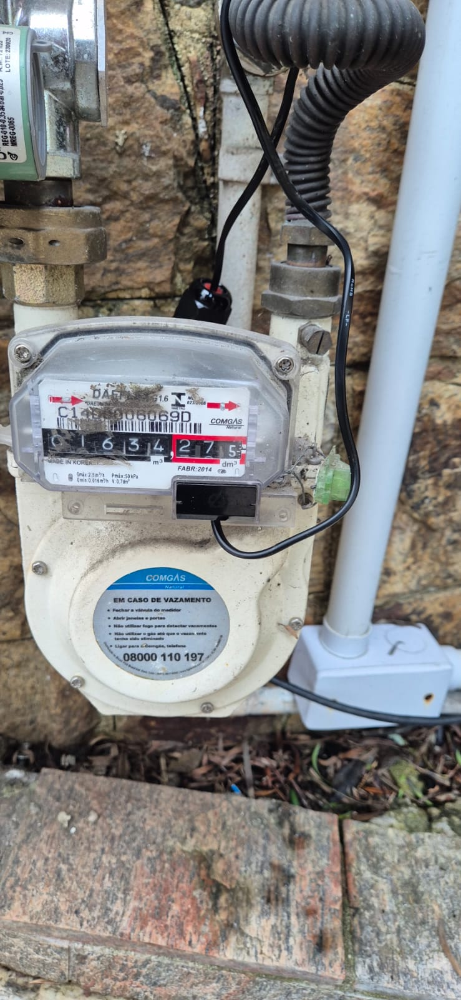
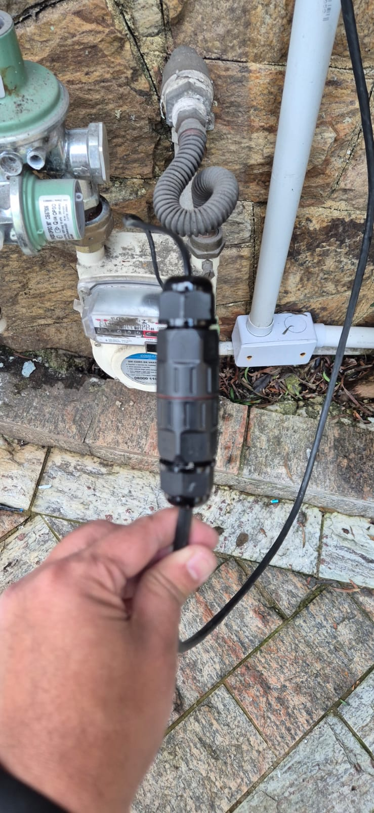
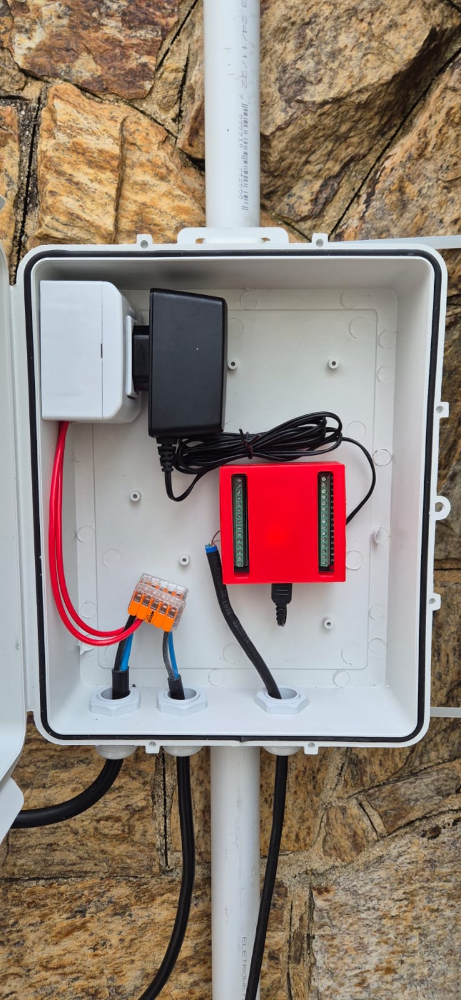

# Instalação — passo a passo

> **Sensor sem solda.** A ligação do reed é por borne parafusável (placa adaptador) e WAGO. A parte de **220 V** (tomada + fonte) exige cuidado: energia desligada na montagem e, idealmente, validação por eletricista.

---

## 1. Hardware necessário

Veja a [lista de materiais completa no README](../README.md#lista-de-materiais). O essencial:

- Reed switch DAEFLEX
- ESP32 DOIT DevKit + placa adaptador com bornes + case 3D
- Caixa hermética IP65 + prensa-cabos PG16
- Emenda IP68 + cabo CAT6 FTP
- Tomada externa 10 A + fonte micro-USB 5 V / 3 A
- Conectores WAGO 221

---

## 2. Instale o reed no medidor

1. Encaixe o reed switch na lateral/base do contador, **alinhado ao último dígito** (rolo com o ímã).
2. Prenda o corpo do reed (a maioria vem com presilha/encaixe próprio). **Não abra o medidor nem rompa o lacre.**
3. Detalhes e o porquê em [CABEAMENTO.md](CABEAMENTO.md).

---

## 3. Emenda: reed ↔ cabo de extensão

1. Descasque ~10 mm das pontas.
2. Use a **emenda IP68 (conector alavanca 2 vias)** para juntar os 2 fios do reed ao **par laranja** do CAT6 FTP.
3. Feche e vede bem a emenda (ela fica exposta ao tempo).

---

## 4. Monte a caixa IP65 na parede

1. Posicione a caixa **ao lado** do medidor (sem obstruir o respiro do abrigo de gás).
2. Marque e fure a parede; fixe a caixa pelos furos/orelhas. Vede cabeças de parafuso.
3. Com a **broca escalonada**, abra os furos dos prensa-cabos **na face inferior** (água escorre, não entra). Instale os prensa-cabos PG16 com vedação e contraporca.

---

## 5. Parte elétrica 220 V (energia DESLIGADA)

> ⚠️ Desligue o disjuntor antes. Em caso de dúvida, chame um eletricista. Eletricidade perto de gás exige cuidado redobrado.

1. Passe o cabo de alimentação pelo prensa-cabo de força.
2. Distribua Fase / Neutro / Terra com o **WAGO 221** até a **tomada externa 10 A**. Aterramento é obrigatório.
3. Plugue a **fonte 5 V** na tomada.

> 💡 Recomendado: disjuntor/DR no circuito de origem para proteção.

---

## 6. Ligação: cabo do reed ↔ placa adaptador

1. Passe o cabo CAT6 FTP pelo prensa-cabo dedicado.
2. Afrouxe o borne **GPIO27** (marcado **D27** na placa), enfie o fio de sinal e aperte.
3. Afrouxe o borne **GND**, enfie o fio de retorno **e a malha (shield)** do FTP, e aperte.
4. Dê um leve puxão em cada fio para conferir.

---

## 7. Monte o ESP32 e feche o case

1. Encaixe o ESP32 na placa adaptador **respeitando a orientação do USB** (acessível pela abertura).
2. Confira que nenhum pino ficou torto ou de fora.
3. Feche o case 3D e acomode tudo na caixa IP65.

---

## 8. Flash do firmware ESPHome

1. Tenha o **ESPHome** rodando (add-on do Home Assistant ou CLI).
2. Copie [`esphome/medidor-gas.yaml`](../esphome/medidor-gas.yaml) para o seu ESPHome.
3. Copie [`esphome/secrets.yaml.example`](../esphome/secrets.yaml.example) para `secrets.yaml` e preencha Wi-Fi, `api_key`, `ota_password` e `ap_password`.
4. Conecte o ESP32 no computador via USB.
5. No ESPHome: **Install → Plug into this computer** (o **primeiro flash precisa ser por USB**; OTA só funciona depois que já há firmware no ESP).
6. As próximas atualizações podem ser **OTA**.

> ⚠️ **Use uma `api_key` exclusiva** para este device (não reaproveite a de outro ESP). Chave repetida causa conflito na adoção pelo Home Assistant.

---

## 9. Adoção no Home Assistant

1. O HA deve detectar o ESPHome automaticamente ("Descoberto").
2. Clique em **Configurar** e cole a **chave de criptografia** (`api_key`) quando pedida.
3. Confira as entidades:
   - `sensor.medidor_de_gas_vazao_gas` (m³/h)
   - `sensor.medidor_de_gas_volume_gas` (m³)

---

## 10. Configuração do utility_meter

O acumulado do ESP32 vive na RAM e **zera a cada reboot**. O `utility_meter` resolve.

Use o snippet [`home-assistant/utility_meter.yaml`](../home-assistant/utility_meter.yaml) (cole no `configuration.yaml` e reinicie), **ou** crie pela interface: Configurações → Dispositivos e Serviços → Ajudantes → Criar ajudante → **Medidor de consumo**.

---

## 11. Energy dashboard

1. Configurações → **Painéis → Energia**.
2. Em **Consumo de gás**, adicione o sensor mensal (ex.: `sensor.consumo_de_gas_mensal`).
3. Os gráficos aparecem após algumas horas de dados.

---

## 12. Validação inicial

1. Anote a leitura do **display do medidor** (precisão de 1 L — o último dígito vermelho).
2. Anote o `Volume Gás` no Home Assistant.
3. Use gás deliberadamente (acenda o aquecedor/fogão por um tempo) — quanto mais volume, menor o erro relativo.
4. Compare: o incremento no HA deve bater com o display (a cada 10 L = 1 pulso = +0,01 m³).
5. Se não bater, calibre — veja **[CALIBRACAO.md](CALIBRACAO.md)**.

---

➡️ Problemas? Vá para **[DIAGNOSTICO.md](DIAGNOSTICO.md)**.
